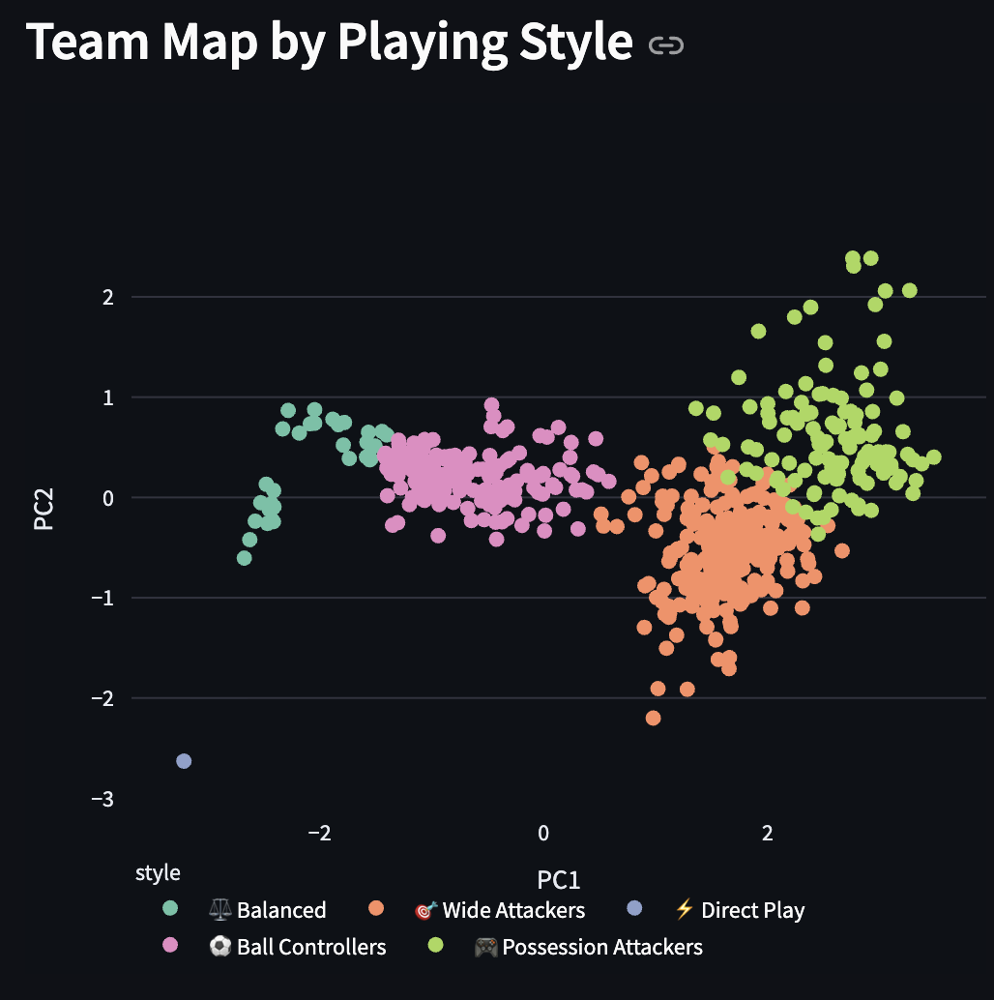
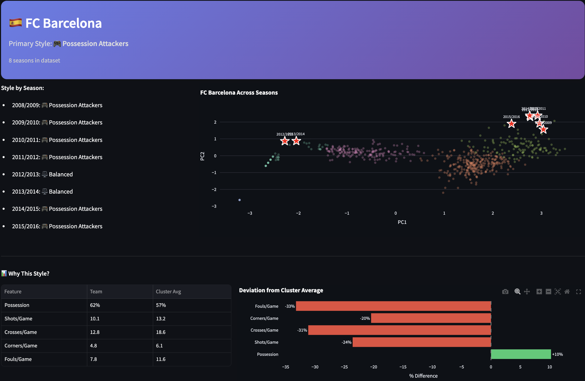
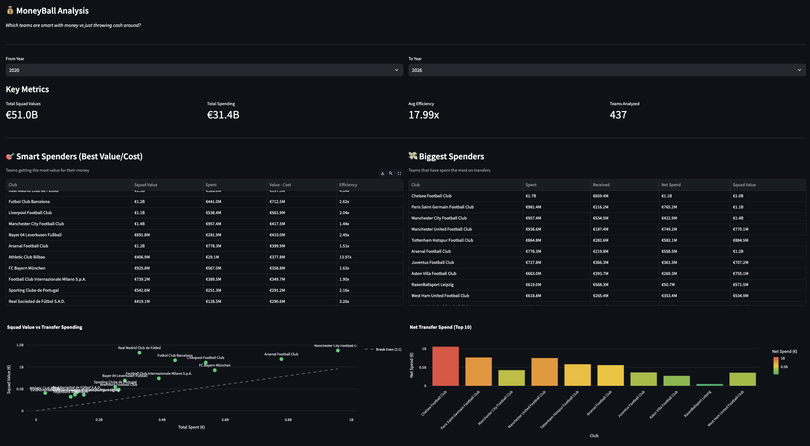

# European Soccer Style Clustering & MoneyBall Analysis

Analyze playing styles and transfer market efficiency for Europe's top 5 leagues (Premier League, La Liga, Serie A, Bundesliga, Ligue 1).

## Screenshots

### Cluster Overview

*PCA visualization of playing styles with cluster summaries*

### Team Search

*Search any team to see their style history and why they belong to their cluster*

### MoneyBall Analysis

*Transfer market efficiency - smart spenders vs big spenders*

## Features

### Style Clustering (2008-2024)
Clusters teams into distinct playing styles using match statistics:
- **Full Features (2008-2016)**: possession, shots, crosses, corners, fouls
- **Reduced Features (2016-2024)**: shots, corners, fouls

Identifies styles like "Possession Attackers", "Direct Play", "Ball Controllers", etc.

### MoneyBall Analysis (2015-2026)
Analyzes transfer market efficiency using TransferMarkt data:
- Squad value vs transfer spending
- Smart spenders (best value for money)
- Big spenders (highest spending clubs)
- Efficiency rankings and ROI metrics

### Interactive Dashboard
- Time period selector (2008-2016, 2016-2024, or All Years)
- Cluster visualizations with PCA projections
- Team search with style history
- Feature highlighting showing why teams belong to clusters
- Financial profiles integrated with style data

## Quick Start

```bash
# Install dependencies
pip install -r requirements.txt

# Download the Kaggle database (2008-2016 data)
# Place at: data/database.sqlite
# Source: https://www.kaggle.com/datasets/hugomathien/soccer

# Download transfer market data
python setup_transfer_data.py

# Download post-2016 match data (optional)
python setup_football_data.py

# Run the dashboard
streamlit run app.py
```

## Data Sources

| Source | Period | Data |
|--------|--------|------|
| [Kaggle European Soccer](https://www.kaggle.com/datasets/hugomathien/soccer) | 2008-2016 | Match stats, player ratings |
| [football-data.co.uk](https://www.football-data.co.uk/) | 2016-2024 | Match results, shots, corners, fouls |
| [TransferMarkt](https://github.com/salimt/football-datasets) | 2015-2026 | Transfer fees, squad valuations |

## Project Structure

```
euro-style-clusters/
├── app.py                      # Streamlit dashboard
├── main.py                     # CLI analysis
├── setup_transfer_data.py      # Download TransferMarkt data
├── setup_football_data.py      # Download football-data.co.uk
├── src/
│   ├── config.py               # Configuration constants
│   ├── data_loader.py          # Kaggle SQLite loader
│   ├── feature_engineering.py  # Feature aggregation & normalization
│   ├── football_data_loader.py # football-data.co.uk loader
│   ├── transfer_data.py        # TransferMarkt data processing
│   ├── team_mapping.py         # Cross-dataset team matching
│   ├── clustering.py           # K-means/hierarchical clustering
│   └── visualization.py        # Plotting functions
├── notebooks/
│   └── 01_explore_data.ipynb   # Data exploration
├── data/                       # Downloaded data (gitignored)
└── reports/                    # Generated outputs
```

## Style Features

**Full Features (Kaggle 2008-2016)**:
- `avg_possession` - Ball control preference
- `avg_shots` - Attacking intent
- `avg_crosses` - Width of play
- `avg_corners` - Set piece focus
- `avg_fouls` - Physicality

**Reduced Features (football-data.co.uk 2016-2024)**:
- `avg_shots`, `avg_corners`, `avg_fouls`
- (Possession/crosses not available from free sources)

## Dashboard Tabs

1. **Overview** - PCA cluster visualization, radar charts
2. **Team Search** - Find any team's style history + financial profile
3. **Timeline** - Track team evolution over seasons
4. **Leagues** - Compare styles across leagues
5. **MoneyBall** - Transfer efficiency rankings
6. **Export** - Download cluster assignments

## Example Insights

- Athletic Bilbao achieves 4.2x value efficiency due to their Basque-only policy
- "Possession Attackers" style has highest championship count
- Post-2016 Premier League shows increased shot volume across all teams

## Requirements

- Python 3.8+
- See `requirements.txt` for packages

## License

MIT
